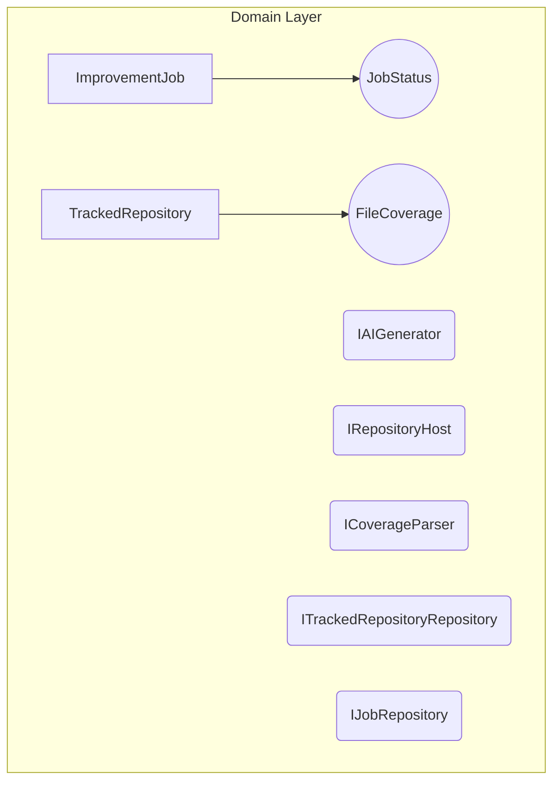

# TS Coverage Improver

A tool to automatically scan GitHub repositories for low TypeScript test coveragen and generate Jest tests via AI to create Pull Requests.

## Video Demo

https://www.loom.com/share/6a04ab0379964b83ac842432a90120bd

## Example PRs
- Example repo: https://github.com/georg-ep/test-ts-repo/pull/25
- PRs: https://github.com/georg-ep/test-ts-repo/pulls

## Features
- **Coverage Parsing**: Analyzes GitHub repos and finds low test coverage TS files.
- **AI Test Generation**: Uses the `gemini` CLI tool in an isolated sandbox to generate comprehensive test suites achieving at least 80% coverage.
- **Automated PRs**: Pushes generated tests to a new branch and automatically creates a PR back to the repo.

## Architecture & Domain Model (DDD)

The backend uses **NestJS** and **TypeORM (SQLite)** implementing strict Domain-Driven Design constraints. Business logic is pure and framework-independent.

### Domain Layer (Core)
Contains pure domain entities, value objects, and repository interfaces.

**Domain Glossary:**
- **`ImprovementJob` (Entity)**: Represents a single unit of work to improve test coverage for a specific `filePath` in a specific `repositoryUrl`. Tracks the `JobStatus` (Queued, Cloning, Analyzing, Generating, Pushing, PR Created, Failed).
- **`TrackedRepository` (Entity)**: Represents a GitHub repository being monitored by the system. Caches the `lastCoverageReport`.
- **`JobStatus` (Value Object)**: An enumeration of the states a job transitions through.
- **`FileCoverage` (Value Object)**: A simple data structure holding a `filePath` and its `linesCoverage` percentage.
- **Interfaces**: Contracts that the infrastructure layer must fulfill (e.g., `IAIGenerator`, `IRepositoryHost`, `ICoverageParser`, `IJobRepository`).

**Domain Diagram:**


### Application Layer (Use Cases)
Orchestrates domain objects to fulfill user requests. Has no knowledge of HTTP or Databases.
- **`ImproveCoverageUseCase`**: The primary coordinator. Fetches a job, checks GitHub permissions, clones the repo, calculates test paths (`*.test.ts`), invokes the AI generator, and pushes the PR.
- **Services**: Orchestrators for creating jobs, adding tracking, etc.

### Infrastructure Layer (Implementations)
Framework-specific adapters that fulfill the Domain interfaces.
- **`GeminiGeneratorService`**: Implements `IAIGenerator` by invoking the `gemini` CLI securely within an isolated Docker sandbox.
- **`CoverageParserService`**: Implements `ICoverageParser` by executing Jest runs in an isolated Docker sandbox.
- **`GitHubService`**: Implements `IRepositoryHost` using Octokit and simple-git.
- **Repositories**: SQLite persistence via TypeORM.
- **`SandboxExecutorService`**: Manages secure, isolated Docker container execution for both AI code generation and untrusted test execution.

## Prerequisites
- Node.js (v20+)
- GitHub Personal Access Token (`repo` scope)
- Google Gemini API Key
- Docker (for isolated test validation)

## Setup & Running

The easiest and recommended way to run the entire stack (Frontend, Backend, Worker, Redis) is via Docker Compose:

```bash
# 1. Setup environment variables
cp .env.example .env
# Edit .env and add your GITHUB_TOKEN and GEMINI_API_KEY

# 2. Start the full stack
docker compose up --build
# The UI dashboard will be available at http://localhost:8080
```

### Manual Local Development (Alternative)
If you prefer running services individually:

1. **Infrastructure**: `docker compose up -d redis`
2. **Backend**: `cd backend && npm install && npm run start` (Starts on port 3000)
3. **Worker**: `cd backend && node dist/worker.js` (Required for background jobs)
4. **Frontend**: `cd frontend && npm install && npm run dev` (Starts on port 5173)

## Usage
1. Open the UI dashboard (`http://localhost:8080` if using Docker Compose, or `http://localhost:5173` if running Vite locally).
2. Enter a GitHub repository URL (e.g., `https://github.com/your-org/typescript-project`).
   *Note: Target repository should have `jest` and `ts-jest` installed.*
3. The system will automatically trigger an initial coverage scan.
4. Click "Improve All" or individual "Improve" buttons next to files with coverage gaps.
5. Track the job progress on the right sidebar. Once done, click "View PR".

## Technical Stack
- **Backend & Worker**: NestJS, TypeORM, SQLite, BullMQ, Node.js.
- **Frontend**: Vite, React, TailwindCSS.
- **AI & Sandboxing**: `gemini` CLI, Docker.
